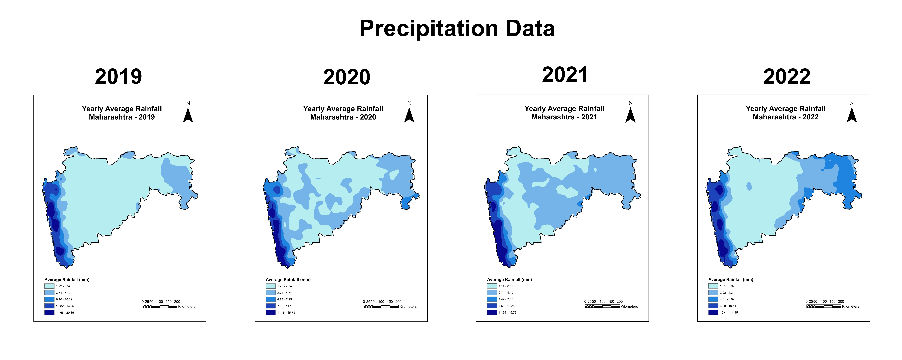

# Strategies for Deep Aquifer Resources - Maharashtra, India

## Project Overview

Underground water is an important resource for industrial, agricultural and domestic purposes. Aquifers which are the reservoirs of the groundwater in the subsurface geological formations control the storage and permeability conditions. Understanding the water usage dynamics is an important aspect to assess the Groundwater expenditure, extraction, recharge and distribution conditions of a region. With the proper analysis of the spatio-temporal fluctuations of groundwater, major contribution can be made in implementing strategies to conserve and use groundwater sustainably.

> [!NOTE]
> This study is a part of Group Project "Groundwater: Mining and Depletion, Strategies for Deep Aquifer Resources, and Arsenic Contamination" by Kalyankar Anirudh, Damanjit Singh, Sushma Asari and Danal Singh for the course EES 502: Contemporary Environmental Issues (January 2024 - April 2024)

**Objective** - Focused on Deep Aquifer Resources of Maharashtra, India using Remote sensing techniques.

## Tools Used

<table>
  <tr>
    <td align="center" width="150">
      <a href="https://qgis.org/" target="_blank" rel="noopener noreferrer">
         
        <b>QGIS</b>
      </a>
    </td>
    <td align="center" width="150">
      <a href="https://www.esri.com/en-us/arcgis/products/arcgis-desktop/resources" target="_blank" rel="noopener noreferrer">
         
        <b>ArcMap</b>
      </a>
    </td>
    <td align="center" width="150">
      <a href="https://www.python.org/" target="_blank" rel="noopener noreferrer">
         
        <b>Python</b>
      </a>
    </td>
  </tr>
</table>

## Data

- 1°x1° Level 3 Gridded GRACE-FO data - [NASA EarthData Repository](https://search.earthdata.nasa.gov/search)

- 1°x1° GLDAS data - [NASA EarthData Repository](https://search.earthdata.nasa.gov/search/granules?p=C2036877565-POCLOUD&pg%5B0%5D%5Bv%5D=f&pg%5B0%5D%5Bgsk%5D=-start_date&tl=1387598355.542!5!!)

- 0.25° x 0.25° Daily rainfall data - [IMD Pune](https://imdpune.gov.in/cmpg/Griddata/Rainfall_25_NetCDF.html)

## Working Principle

 For plotting the Groundwater anomaly (GWa) of the region we have used GRACE-FO (Gravity Recovery and Climate Experiment Follow-On) satellite data which measures the Terrestrial Water Storage anomaly (TWSa) in water Equivalent Height metrics (in cm) using the gravity measurements and GLDAS (Global Land Data Assimilation System Models) data to get the Soil Moisture Anomalies (SMa) and Canopy Anomalies (CANa) both in kg/m2 which are important constituents of the Hydrological equation 

$$
TWS_a = SW_a + CAN_a + SM_a + GW_a + SWE_a \quad (i)
$$

 $$
 GW_a = TWS_a – (SW_a + SM_a + CAN_a)\quad (ii) 
$$

From equation (ii) it is evident that by removing the SMa and CANa from the TWSa we can find out the GWa for the region. 

## Results

_Fig: Maps showing GRACE-FO Groundwater Anomaly for the years 2019, 2020, 2021 and 2022_

_Fig: Yearly Mean Preceipitation Maps for the Maharashtra region for the years 2019, 2020, 2021 and 2022_

- GRACE-FO derived groundwater anomaly maps highlight negative anomalies (red shades) as zones of decline and positive anomalies (blue shades) as regions of recovery.

- The southern districts (Solapur, Usmanabad, Latur, Beed) represent the most groundwater-stressed zone, where intensive extraction drives persistent scarcity despite post-monsoon recharge.

- The western coastal region displays post-monsoon negative anomalies, largely reflecting dataset artifacts, as substantial rainfall in the forested Western Ghats is partitioned into soil moisture and canopy storage.

- The eastern sector similarly exhibits negative anomalies, influenced by deciduous forest cover and moderate rainfall, where vegetation and soil processes mask actual groundwater status.

## Conclusion

Analysis of groundwater anomalies using both in-situ wells and GRACE-FO satellite data shows that southern Maharashtra (Aurangabad and Pune divisions) is experiencing significant groundwater depletion, largely due to water-intensive sugarcane cultivation. To address this, water-saving irrigation methods, drought-resistant crop varieties, managed aquifer recharge, percolation structures, and strict groundwater regulation should be implemented.

## License

This work (figures, results, and analysis) is licensed under [CC BY 4.0](LICENSE).

